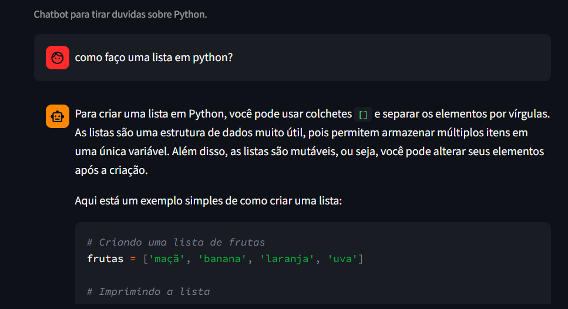
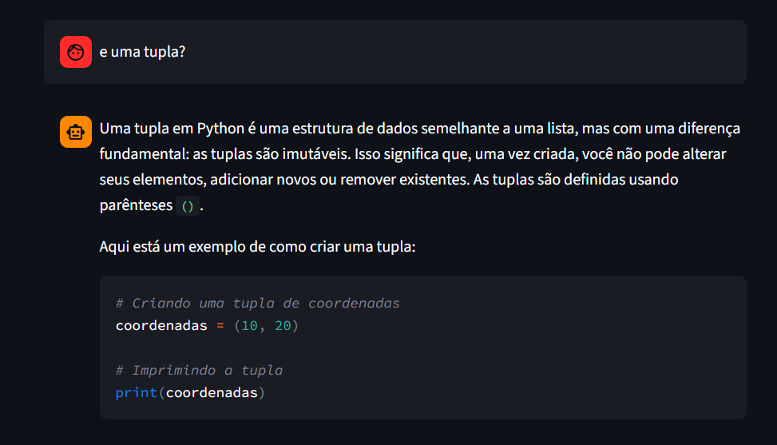
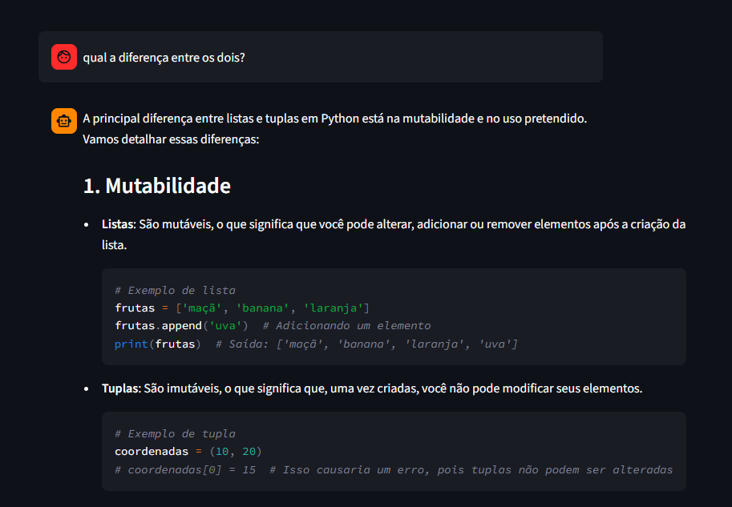

# PyBot

Chatbot em Python com LangChain + OpenAI, focado em tirar duvidas sobre Python e seguir boas praticas.

## Requisitos

- Python 3.12+
- Poetry instalado

## Configuração

1. Instale as dependências:

```bash
poetry install
```

2. Crie/edite o arquivo `.env` na raiz do projeto:

```env
OPENAI_API_KEY=sua_chave_aqui
```

## Executar o projeto

### Opção 1: Interface CLI

```bash
poetry run task run
```

Para encerrar, digite `sair`, `exit` ou `quit`.

### Opção 2: Interface web (Streamlit)

```bash
poetry run task web
```

Depois abra a URL exibida no terminal (geralmente `http://localhost:8501`).

## Comandos de qualidade

- `poetry run task lint` - valida regras do Ruff
- `poetry run task format` - formata codigo com Ruff
- `poetry run task format-check` - valida formatação sem alterar arquivos
- `poetry run task sort` - organiza imports com isort
- `poetry run task sort-check` - valida imports sem alterar arquivos
- `poetry run task check` - roda lint + format-check + sort-check

## Estrutura do projeto

```text
.
|-- app/
|   |-- chatbot.py     # loop interativo + prompt de sistema
|   |-- main.py        # ponto de entrada da aplicação CLI
|   `-- streamlit_app.py  # ponto de entrada da aplicação web
|-- config/
|   |-- config.py     # leitura de variaveis de ambiente
|   |-- errors.py     # tratamento de erros
|   |-- llm.py        # configuração do LLM
|   |-- logger.py     # configuração de logs com Loguru
|   `-- prompts.py     # definição de prompts
|-- pyproject.toml
|-- poetry.lock
|-- README.md
`-- .env
```

## 🧠 Arquitetura

- Separação entre interface, lógica de negócio e configuração
- Serviço de LLM isolado para fácil manutenção
- Prompt engineering dedicado

## Exemplos de perguntas sobre Python









## Observações

- O bot usa `gpt-4o-mini` por padrão.
- O prompt de sistema foi desenhado para respostas didáticas em português.
- Logs da aplicação são emitidos com Loguru.
